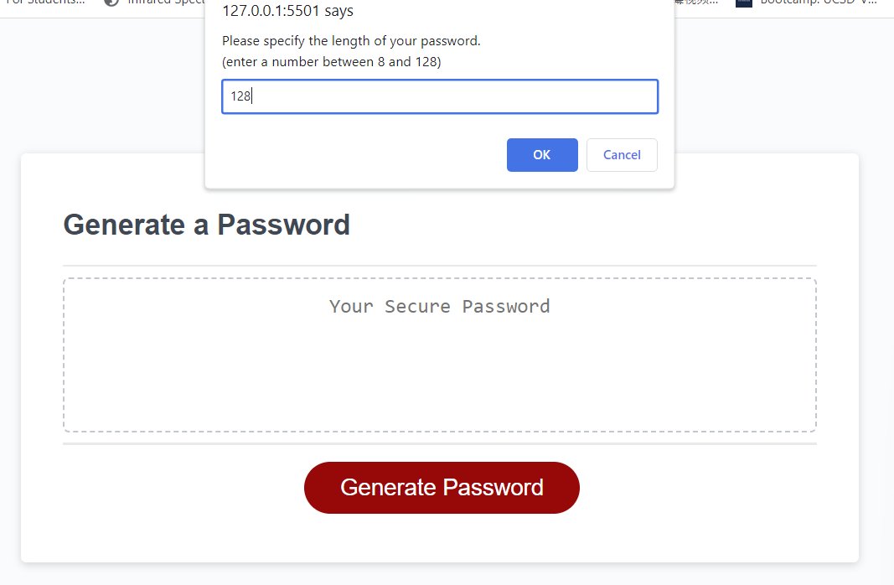
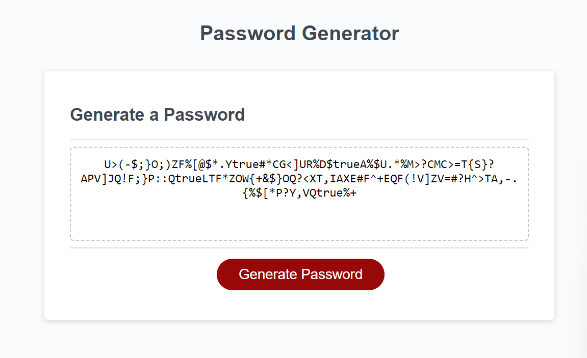

# Password Generator Starter Code

## Description

This webpage of random password generator was made by Yilun Fan for study use.

## Installation

N/A

## Usage

On this webpage,  when you click the "Generate Password" button, you will be prompted to input a numeric number for the length of the password. If you enter an alphabetic character, you will be prompted to input the value again, and if you press cancel on the prompt, the process will be terminated, and you will need to click the button to start the function to restart. After you input the numeric number in the prompt, you will be prompted to choose if you want uppercase characters, lowercase characters, numerical numbers, and special characters or not, if you select none of those four criteria, you will be prompted to them again.

## Credits

N/A

## License

N/A

## Screenshots

